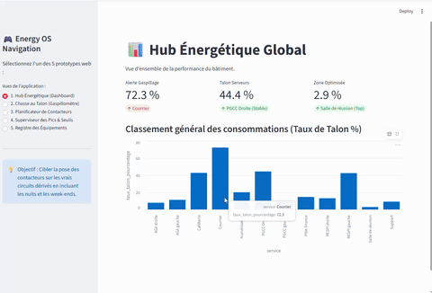

# ⚡ Smart Facility Energy OS : Pipeline de Pilotage de la Consommation
> Une application "Data-to-Action" connectée pour auditer, simuler et optimiser la consommation électrique d'un site industriel/tertiaire tertiaire à l'aide de l'IA et de l'automatisation.

## 📺 Démonstration de l'Application

Voici une démonstration de l'interface Smart Facility Energy OS en action, montrant le Hub, le simulateur de ROI interactif et le dashboard de maintenance préventive.



## 📊 Problématique et Vision

La transition énergétique des bâtiments tertiaires (en réponse notamment au Décret Tertiaire) se heurte souvent à un fossé entre les rapports de Data et les actions de maintenance sur le terrain. L'audit énergétique classique est un processus figé, coûteux et complexe à traduire en bons de travaux pour les électriciens.

**Smart Facility Energy OS** jette un pont entre ces deux mondes. Il utilise l'analyse statistique avancée sur les courbes de charge réelles pour identifier instantanément les gisements d'économie (talons de nuit/week-end) et simuler l'installation de **contacteurs programmables** avec un calcul de ROI immédiat.

## 🕹️ Fonctionnalités Clés (Les 5 Prototypes)

1. **📊 Hub Énergétique (Dashboard Strategy) :** Vue macroscopique dynamique pour obtenir la "météo énergétique" du site en 3 secondes (pire service, performance globale).
2. **🦹 Le Gaspillomètre (Nuits & Week-ends) :** Chiffrage financier des pertes énergétiques invisibles sur les 4 836 heures d'inoccupation annuelles.
3. **🔌 Planificateur IoT & ROI (Aide à la Décision) :** Simulateur interactif. En cochant les circuits à couper hors occupation, l'application calcule automatiquement l'investissement requis (matériel + pose), les gains annuels cumulés, le temps de retour sur investissement (ROI en mois) et rédige automatiquement l'ordre de travaux pour l'électricien.
4. **⚡ Superviseur des Pics & Maintenance (Préventif) :** Dashboard d'analyse des pointes de charge à J+1 (prévision API Enedis). Il compare les pics aux Percentiles 95 pour détecter les anomalies de comportement des machines et planifier la maintenance préventive avant la panne.
5. **📦 Registre de Criticité (Garde-fou Sécurité) :** Cartographie technique pour sanctuariser les infrastructures critiques (serveurs en cascade, baies de brassage réseau) et interdire les coupures accidentelles.

## ⚙️ Stack Technique

* **Base de données :** SQL (SQLite)
* **Algorithmes & Statistiques :** Python (Pandas, Numpy)
* **Application Web :** Streamlit (Multi-pages & Interactivité)
* **Business Intelligence :** Power BI (pour dashboards complexes)
* **Automatisation :** Google Apps Script (interconnexion de sources hétérogènes)
* **IA :** Google Gemini (Automatisation de processus & Aide à l'analyse métier)

## 🚀 Comment lancer l'application localement

### Prérequis

* Python 3.8+
* Pip

### Installation

1. Cloner le dépôt :
   ```bash
   git clone [https://github.com/TON_USERNAME/NOM_DU_REPO.git](https://github.com/TON_USERNAME/NOM_DU_REPO.git)
   cd NOM_DU_REPO

2. Installer les dépendances :
pip install -r requirements.txt

3. Installer Streamlit :
streamlit run app_energy_os.py
